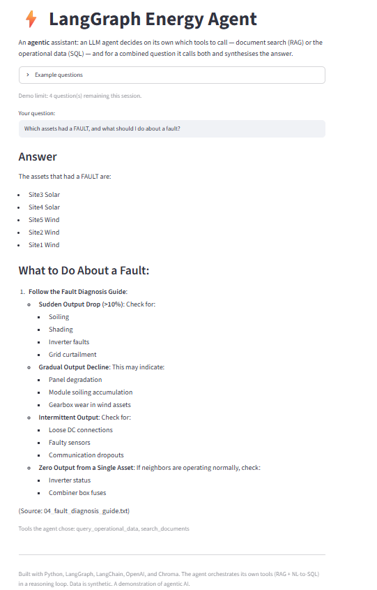

# ⚡ LangGraph Energy Agent (Agentic AI)

**🔗 Live demo:** https://anurilanggraph-energy-agent.streamlit.app/

## Demo



An Agentic AI assistant for energy operations, built with **LangGraph**. Unlike a hand-coded
router, here an LLM agent decides on its own which tools to call — and for a combined question it
calls multiple tools in sequence and synthesises the answer.

This is the agentic counterpart to a hand-built RAG + orchestrator project: same domain, but the
LLM orchestrates its own tool use in a reasoning loop (the ReAct pattern) rather than following
if/else routing I wrote.

## What it does
The agent has two tools and chooses between them per question:
- **search_documents** — RAG over energy-operations documents (procedures, thresholds, guidance), grounded and cited.
- **query_operational_data** — natural-language-to-SQL over an operational data table (counts, statuses, anomalies; read-only queries).

For a combined question ("which assets faulted, and what should I do about it?"), the agent
decomposes it itself, calls both tools, and merges the results — no hand-written routing.

## Architecture (LangGraph)
- **State** — the message history that flows through the graph.
- **Agent node** — the LLM decides: call a tool, or answer.
- **Tool node** — runs the chosen tool; the result returns to the agent.
- **Conditional edge** — loops agent → tool → agent until the agent produces a final answer.

## Tech stack
- **Python**, **LangGraph** + **LangChain**, **OpenAI** (gpt-4o-mini + text-embedding-3-small), **Chroma** (vector store)

## Files
- `hello_graph.py` — a minimal graph demonstrating state / node / edge
- `rag_tool.py` — the documents tool (RAG)
- `sql_tool.py` — the data tool (NL-to-SQL)
- `agent.py` — the two-tool agent and routing policy
- `observability.py` — structured JSONL tracing for observable execution events
- `evaluation/` — deterministic regression benchmark and evaluator
- `docs/agent_evaluation_observability_report.md` — short evaluation and observability report

## Running locally
```bash
python -m venv venv
venv\Scripts\activate          # Windows
pip install -r requirements.txt
# add your key to a .env file:  OPENAI_API_KEY=sk-...
python ingest.py               # build the document index (once)
python agent.py                # run the agent on sample questions
```

## Data
All data is synthetic and created for demonstration — no proprietary content.

## Notes
Built independently to demonstrate agentic AI fundamentals — tools, the ReAct loop, and
LLM-driven tool orchestration — using LangGraph.

## Evaluation & traceability

The repo includes a 26-case deterministic regression benchmark in `evaluation/` covering:

- document/RAG questions,
- SQL/structured-data questions,
- combined multi-tool workflows,
- and unsupported-question refusal.

The evaluator checks tool routing, required facts, source grounding, refusal behaviour,
anti-fabrication guards, end-to-end pass/fail, and latency. Runtime JSONL traces capture
observable events such as requested tools, retrieved source files, generated SQL, result
previews, final answers, failures, and optional user feedback. Hidden chain-of-thought is
not logged.

### Regression result

The first valid benchmark run scored **23/26**. Failure analysis found:

- one genuine agent-routing defect,
- one refusal-detector false negative,
- and one literal asset-name matching false negative.

After adding a general routing/refusal policy to the agent and correcting the two evaluator
measurement issues, the same 26 benchmark cases were rerun and scored 26/26.

The anti-fabrication pattern guards were not weakened between the baseline and final run.

> **Important:** 26/26 is a regression result on a small controlled synthetic benchmark. It is
> not a claim of production-wide 100% reliability.

```bash
python evaluation/run_eval.py --dry-run   # validate benchmark only
python evaluation/run_eval.py             # full run; requires OPENAI_API_KEY
```

See `evaluation/README.md` for benchmark details and
`docs/agent_evaluation_observability_report.md` for the failure analysis, fixes, final metrics,
and limitations.
